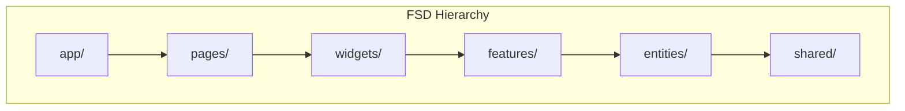

# Architecture FSD + Hexagonale - Plan de Migration Next-Gen

> **Version** : 1.0 | **Date** : 2026-01-08  
> **Stack Cible** : React 18 + MUI + TanStack Query v5 + Zustand + Zod

---

## 📦 Livrable 1 : Audit & Cartographie FSD

### 1.1 Résumé du Legacy

| Métrique | Valeur | Problème |
|:---------|:-------|:---------|
| Fichiers `src/` | ~280 | Structure plate, pas de boundaries |
| Contexts API | 6 | Anti-pattern: `useEffect` + `useState` pour data fetching |
| Services (fetch) | 25 fichiers | Pas de caching, pas de retry, raw fetch |
| God Components | 2 | `FsecDetails` (43 files), `FormModal` (15KB) |

### 1.2 Mapping FSD des Composants Legacy



| Legacy Path | FSD Layer | Nouveau Path | Justification |
|:------------|:----------|:-------------|:--------------|
| `scenes/home/` | **pages** | `pages/home/` | Route principale |
| `scenes/campaigns/` | **pages** | `pages/campaigns/` | Liste des campagnes |
| `scenes/fsecs/` | **pages** | `pages/fsecs/` | Liste des FSEC |
| `scenes/fsecDetails/` | **pages** | `pages/fsec-details/` | Page détail (God → Split) |
| `scenes/stocks/` | **pages** | `pages/stocks/` | Gestion des stocks |
| `core/datatable/` | **widgets** | `widgets/data-table/` | Table réutilisable |
| `core/modal/` | **widgets** | `widgets/modal/` | Modales génériques |
| `core/formComponents/` | **shared** | `shared/ui/form/` | Inputs encapsulés |
| `core/domain/campaign/` | **entities** | `entities/campaign/` | Types + API + hooks |
| `core/domain/fsec/` | **entities** | `entities/fsec/` | Types + API + hooks |
| `core/domain/fsec/steps/` | **entities** | `entities/steps/` | Types + API + hooks par step |
| `hooks/contexts/` | **features** | `features/*/model/` | Zustand stores |
| `services/` | **entities** | `entities/*/api/` | Adapters API |

### 1.3 God Components à Découper

#### `FsecDetails` (43 fichiers → 12 features)

```
scenes/fsecDetails/
├── FsecDetails.tsx              → pages/fsec-details/ui/FsecDetailsPage.tsx
├── FsecDetailsTabs/             → widgets/fsec-tabs/
│   ├── FsecDetailsTabOverview   → features/fsec-overview/
│   ├── FsecDetailsTabAssemblage → features/assembly-step/
│   ├── FsecDetailsTabMetro...   → features/metrology-step/
│   ├── ...                      → features/{step-name}-step/
├── FsecUpdateModal/             → features/update-fsec/
└── STEPS_SEQUENCE_CONSTANTS.ts  → entities/steps/lib/constants.ts
```

#### `FormModal` (15KB → 3 widgets)

| Responsabilité | Nouveau Composant |
|:---------------|:------------------|
| Stepper logic | `widgets/stepper-modal/` |
| Form state | `features/*/model/useFormStore.ts` |
| Validation | `shared/lib/validation/` |

---

## 🔗 Livrable 2 : Matrice de Migration Data & Backend

### 2.1 Endpoints API (Nouveau Backend)

| Route | Méthodes | Controller | Description |
|:------|:---------|:-----------|:------------|
| `/api/campaigns/` | GET, POST | CampaignController | CRUD campagnes |
| `/api/campaigns/{uuid}/` | GET, PUT, PATCH, DELETE | CampaignController | Détail campagne |
| `/api/fsecs/` | GET, POST | FsecController | CRUD FSEC |
| `/api/fsecs/{version_uuid}/` | GET, PUT, DELETE | FsecController | Détail FSEC par version |
| `/api/fsecs/campaign/{uuid}/` | GET | FsecController.list_by_campaign | FSEC par campagne |
| `/api/assembly-steps/` | GET, POST | AssemblyStepController | CRUD assembly |
| `/api/assembly-steps/{uuid}/` | GET, PUT, DELETE | AssemblyStepController | Détail assembly |
| `/api/assembly-steps/fsec/{fsec_id}/` | GET | AssemblyStepController.get_by_fsec | Steps par FSEC |
| *(idem pour 9 autres step types)* | | | |

### 2.2 Correspondance Context → TanStack Query + Zustand

| Feature Front | Ancien Context | Emplacement FSD | Hook TanStack | Endpoint API | Schéma Zod |
|:--------------|:---------------|:----------------|:--------------|:-------------|:-----------|
| **Lister campagnes** | - | `entities/campaign/api/` | `useQuery(campaignKeys.all)` | `GET /api/campaigns/` | `CampaignSchema` |
| **Créer campagne** | - | `features/create-campaign/` | `useMutation(createCampaign)` | `POST /api/campaigns/` | `CampaignCreateSchema` |
| **Détail FSEC** | `FsecContext.fsec` | `entities/fsec/api/` | `useQuery(fsecKeys.detail(uuid))` | `GET /api/fsecs/{uuid}/` | `FsecDetailedSchema` |
| **Modifier FSEC** | `FsecContext.setFsec` | `features/update-fsec/` | `useMutation(updateFsec)` | `PUT /api/fsecs/{uuid}/` | `FsecUpdateSchema` |
| **FSEC par campagne** | `Fsec.context +useEffect` | `entities/fsec/api/` | `useQuery(fsecKeys.byCampaign(uuid))` | `GET /api/fsecs/campaign/{uuid}/` | `z.array(FsecSchema)` |
| **Étape Assemblage** | `FsecContext.assemblyStep` | `entities/steps/api/assembly.ts` | `useQuery(stepKeys.assembly.byFsec(uuid))` | `GET /api/assembly-steps/fsec/{uuid}/` | `AssemblyStepSchema` |
| **Valider Assemblage** | *FormModal submit* | `features/validate-assembly/` | `useMutation(updateAssemblyStep)` | `PUT /api/assembly-steps/{uuid}/` | `AssemblyStepUpdateSchema` |
| **Étape Métrologie** | `FsecContext.metrologyStep` | `entities/steps/api/metrology.ts` | `useQuery(stepKeys.metrology.byFsec(uuid))` | `GET /api/metrology-steps/fsec/{uuid}/` | `MetrologyStepSchema` |
| **Étape Airtightness** | implicite dans FSEC | `entities/steps/api/airtightness.ts` | `useQuery(stepKeys.airtightness.byFsec(uuid))` | `GET /api/airtightness-test-lp-steps/fsec/{uuid}/` | `AirtightnessStepSchema` |
| **Gas Filling LP** | implicite dans FSEC | `entities/steps/api/gas-filling-lp.ts` | `useQuery(stepKeys.gasFillingLp.byFsec(uuid))` | `GET /api/gas-filling-bp-steps/fsec/{uuid}/` | `GasFillingLpSchema` |
| **Gas Filling HP** | implicite dans FSEC | `entities/steps/api/gas-filling-hp.ts` | `useQuery(stepKeys.gasFillingHp.byFsec(uuid))` | `GET /api/gas-filling-hp-steps/fsec/{uuid}/` | `GasFillingHpSchema` |
| **Depressurization** | implicite dans FSEC | `entities/steps/api/depressurization.ts` | `useQuery(stepKeys.depressurization.byFsec(uuid))` | `GET /api/depressurization-steps/fsec/{uuid}/` | `DepressurizationSchema` |
| **Repressurization** | implicite dans FSEC | `entities/steps/api/repressurization.ts` | `useQuery(stepKeys.repressurization.byFsec(uuid))` | `GET /api/repressurization-steps/fsec/{uuid}/` | `RepressurizationSchema` |
| **Permeation** | implicite dans FSEC | `entities/steps/api/permeation.ts` | `useQuery(stepKeys.permeation.byFsec(uuid))` | `GET /api/permeation-steps/fsec/{uuid}/` | `PermeationSchema` |

### 2.3 Query Key Factory (Pattern Recommandé)

```typescript
// entities/campaign/api/campaign.keys.ts
export const campaignKeys = {
  all: ['campaigns'] as const,
  lists: () => [...campaignKeys.all, 'list'] as const,
  detail: (uuid: string) => [...campaignKeys.all, 'detail', uuid] as const,
};

// entities/fsec/api/fsec.keys.ts
export const fsecKeys = {
  all: ['fsecs'] as const,
  detail: (uuid: string) => [...fsecKeys.all, 'detail', uuid] as const,
  byCampaign: (campaignUuid: string) => [...fsecKeys.all, 'campaign', campaignUuid] as const,
};

// entities/steps/api/steps.keys.ts
export const stepKeys = {
  assembly: {
    all: ['assembly-steps'] as const,
    byFsec: (fsecUuid: string) => [...stepKeys.assembly.all, 'fsec', fsecUuid] as const,
    detail: (uuid: string) => [...stepKeys.assembly.all, 'detail', uuid] as const,
  },
  metrology: { /* idem */ },
  // ... 10 types de steps
};
```

### 2.4 Schémas Zod Critiques

```typescript
// entities/campaign/model/campaign.schema.ts
import { z } from 'zod';

export const CampaignApiSchema = z.object({
  uuid: z.string().uuid(),
  name: z.string().min(1),
  year: z.number().int(),
  semester: z.enum(['S1', 'S2']),
  type_id: z.number().nullable(),      // snake_case from API
  status_id: z.number().nullable(),
  installation_id: z.number().nullable(),
  start_date: z.string().nullable(),
  end_date: z.string().nullable(),
  dtri_number: z.number().nullable(),
  description: z.string().nullable(),
});

// Mapper: API (snake_case) → Domain (camelCase)
export const CampaignSchema = CampaignApiSchema.transform((api) => ({
  uuid: api.uuid,
  name: api.name,
  year: api.year,
  semester: api.semester,
  typeId: api.type_id,           // camelCase for UI
  statusId: api.status_id,
  installationId: api.installation_id,
  startDate: api.start_date ? new Date(api.start_date) : null,
  endDate: api.end_date ? new Date(api.end_date) : null,
  dtriNumber: api.dtri_number,
  description: api.description,
}));

export type Campaign = z.infer<typeof CampaignSchema>;
```

---

## 📁 Structure FSD Cible

```
src/
├── app/                          # Couche Application
│   ├── providers/               # QueryClient, ThemeProvider
│   ├── router/                  # Routes lazy-loaded
│   └── index.tsx
├── pages/                        # Couche Pages (1 dossier = 1 route)
│   ├── home/
│   ├── campaigns/
│   ├── campaign-details/
│   ├── fsecs/
│   ├── fsec-details/
│   └── stocks/
├── widgets/                      # Composants composites (multi-feature)
│   ├── data-table/
│   ├── fsec-tabs/
│   ├── modal/
│   └── stepper-modal/
├── features/                     # Use-cases métier
│   ├── create-campaign/
│   ├── update-fsec/
│   ├── validate-assembly-step/
│   └── ...
├── entities/                     # Objets métier (types, API, hooks)
│   ├── campaign/
│   │   ├── api/                 # API adapters + Query keys
│   │   ├── model/               # Zod schemas + types
│   │   └── ui/                  # Composants spécifiques entity
│   ├── fsec/
│   └── steps/
│       ├── assembly/
│       ├── metrology/
│       └── ...
└── shared/                       # Code partagé (0 business logic)
    ├── api/                     # Fetch wrapper, error handler
    ├── lib/                     # Utilitaires (dates, formatters)
    └── ui/                      # Atoms MUI customisés
```

---

## ✅ Règles d'Or FSD

1. **Dépendance Unidirectionnelle** : `pages → widgets → features → entities → shared`
2. **Public API** : Chaque slice exporte via `index.ts` uniquement
3. **Isolation** : Un feature ne peut pas importer un autre feature
4. **Colocated State** : Zustand stores dans `features/*/model/`
5. **Server State** : TanStack Query dans `entities/*/api/`
6. **Validation Runtime** : Toutes les réponses API passent par Zod

---

## ⚠️ Breaking Changes Backend vs Legacy

| Legacy Endpoint | Nouveau Endpoint | Action Requise |
|:----------------|:-----------------|:---------------|
| `GET /fsec/{uuid}` | `GET /api/fsecs/{version_uuid}/` | Renommer param |
| `GET /fsec/campaign/{uuid}` | `GET /api/fsecs/campaign/{uuid}/` | Ajouter `/api` prefix |
| `PUT /fsec/` | `PUT /api/fsecs/{uuid}/` | Ajouter UUID dans URL |
| `POST /fsec/workflow/assembly/{uuid}` | `PUT /api/assembly-steps/{uuid}/` | Changer route |
| `POST /fsec/workflow/metrology/{uuid}` | `PUT /api/metrology-steps/{uuid}/` | Changer route |
| *Tous les workflow steps* | `/api/{step-type}-steps/{uuid}/` | Steps sont indépendants |
